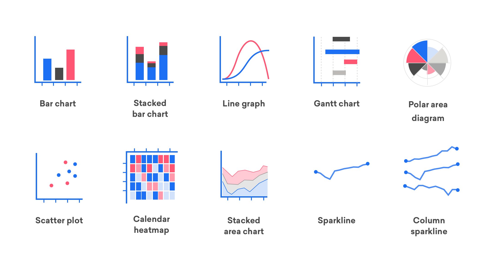
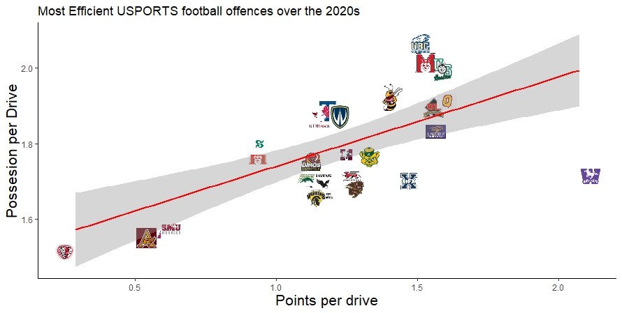
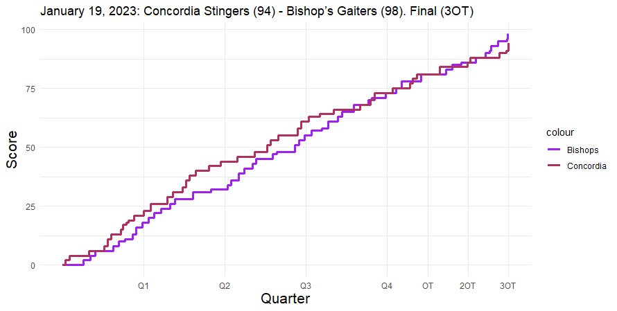
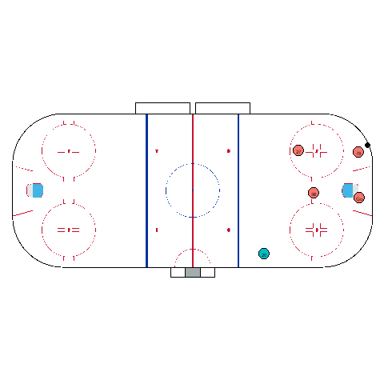
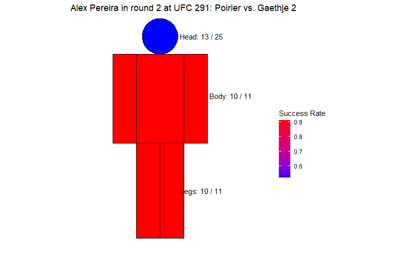
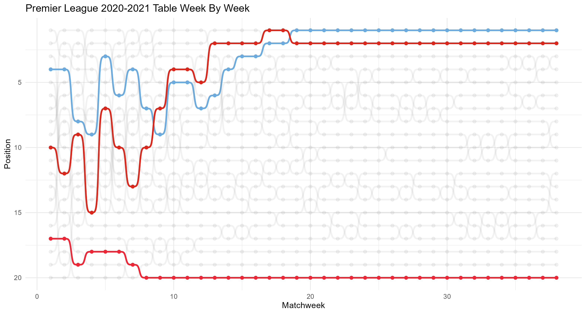
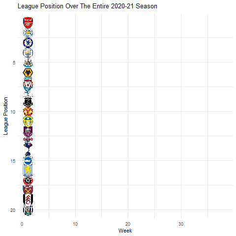

```{r setup, include=FALSE}
knitr::opts_chunk$set(echo = TRUE)
```

## Packages

```{r, eval = FALSE}
library(dplyr)
library(ggplot2)
library(ggbump)
library(ggimage)
library(gganimate)
library(tidyr)
library(sf)
library(sportyR)
library(tidyverse)
```


## What is a Data Visualization

 

- Data visualizations represent data visually, making it easier to identify patterns and trends.
- Popular packages for visualizations: Matplotlib and Seaborn in Python and ggplot in R.

## Example



```{r, eval = FALSE}
plot <- ggplot(drive_analysis, aes (x = average_points_per_drive,
  y = average_time_per_drive)) +
  geom_image(aes(image = team_logo), size = 0.08,
             position = position_jitter(width = 0.1, height = 0.1)) + 
  geom_smooth(method=lm , color="red", se=TRUE) + theme_classic() +
  labs(title = "Most Efficient USPORTS Football Offences Over The 2020s", 
       x = "Points Per Drive",
       y = "Average Duration Per Drive (Minutes)")
```


## Example


```{r, eval = FALSE}
## create game flow chart
game_flow <- ggplot() +
  geom_step(data = game_to_examine,
            aes(x = total_game_seconds, y = away_score, color = "Bishops"), 
             size = 1.25) +
  geom_step(data = game_to_examine,
            aes(x = total_game_seconds, y = home_score, color = "Concordia"),
             size = 1.25) +
  labs(title = "Concordia Vs Bishop's (January 19th 2023) Game Flow Chart",
       x = NULL,
       y = NULL) +
  scale_x_continuous(
    breaks = quarter_breaks,
    labels = c("Q1", "Q2", "Q3", "Q4", "OT", "2OT", "3OT")
  ) +
  theme_minimal() +
  theme(
    panel.grid.minor.x = element_blank(),   
    axis.ticks.x = element_blank()         
  ) +
  scale_color_manual(values = c( Bishops = "purple", Concordia = "maroon"))


```


## Hockey Tracking Data Visualization

```{r}
team_a_tracking <- read.csv("https://github.com/bigdatacup/Big-Data-Cup-2025/releases/download/Data/2024-10-25.Team.H.@.Team.G.-.Tracking.csv")

glimpse(team_a_tracking)
```


```{r, eval = FALSE}
p <- sportyR::geom_hockey("nhl") + geom_point(data = curr_team %>% filter(Player.or.Puck == "Player"),
                                                aes(x = Rink.Location.X..Feet., y = Rink.Location.Y..Feet.,fill = Team),shape = 21, size = 6,
                                                show.legend = F) +
                                                geom_text(data = curr_team %>% filter(Player.or.Puck == "Player"),
                                                aes(x = Rink.Location.X..Feet., y = Rink.Location.Y..Feet., label = Player.Id),
                                                color = "black", size = 2,show.legend = F) +
                                                geom_point(data = curr_team %>%  filter(Player.or.Puck == "Puck"),
                                                aes(x = Rink.Location.X..Feet., y = Rink.Location.Y..Feet.,
                                                size = Rink.Location.Z..Feet.),fill = "black",shape = 21,size = 3,
                                                show.legend = F) + transition_time(id)


p2 <- animate(p, fps = 30, duration = (max_frame - min_frame)/30 + 1, renderer = gifski_renderer())
```




## UFC Hit Rate Data Visualization

```{r, eval = FALSE}
create_circle <- function(center = c(0, 0), radius = 1, npoints = 100) {
  theta <- seq(0, 2 * pi, length.out = npoints)
  x <- center[1] + radius * cos(theta)
  y <- center[2] + radius * sin(theta)
  cbind(x, y)
}

# Function to create the human silhouette plot with the provided data
create_human_silhouette <- function(data) {
  # Calculate success rates
  head_rate <- data$head_landed / data$head_attempted
  body_arm_rate <- data$body_landed / data$body_attempted
  left_leg_rate <- data$leg_landed / data$leg_attempted
  right_leg_rate <- data$leg_landed / data$leg_attempted

  # Define coordinates for each body part
  head_coords <- create_circle(center = c(1.5, 9.5), radius = 0.75)
  body_coords <- matrix(c(0.5, 5, 0.5, 8.75, 2.5, 8.75, 2.5, 5, 0.5, 5), ncol = 2, byrow = TRUE)
  left_arm_coords <- matrix(c(-0.5, 5, 0.5, 5, 0.5, 8.75, -0.5, 8.75, -0.5, 5), ncol = 2, byrow = TRUE)
  right_arm_coords <- matrix(c(2.5, 5, 3.5, 5, 3.5, 8.75, 2.5, 8.75, 2.5, 5), ncol = 2, byrow = TRUE)
  left_leg_coords <- matrix(c(0.5, 1, 0.5, 5, 1.5, 5, 1.5, 1, 0.5, 1), ncol = 2, byrow = TRUE)
  right_leg_coords <- matrix(c(1.5, 1, 1.5, 5, 2.5, 5, 2.5, 1, 1.5, 1), ncol = 2, byrow = TRUE)

  # Create sf objects for each body part
  head <- st_polygon(list(head_coords)) %>% st_sfc(crs = 4326) %>% st_sf(part = "head", rate = head_rate)
  body <- st_polygon(list(body_coords)) %>% st_sfc(crs = 4326) %>% st_sf(part = "body", rate = body_arm_rate)
  left_arm <- st_polygon(list(left_arm_coords)) %>% st_sfc(crs = 4326) %>% st_sf(part = "left_arm", rate = body_arm_rate)
  right_arm <- st_polygon(list(right_arm_coords)) %>% st_sfc(crs = 4326) %>% st_sf(part = "right_arm", rate = body_arm_rate)
  left_leg <- st_polygon(list(left_leg_coords)) %>% st_sfc(crs = 4326) %>% st_sf(part = "left_leg", rate = left_leg_rate)
  right_leg <- st_polygon(list(right_leg_coords)) %>% st_sfc(crs = 4326) %>% st_sf(part = "right_leg", rate = right_leg_rate)

  # Combine all parts into one sf object
  silhouette <- bind_rows(head, body, left_arm, right_arm, left_leg, right_leg)

  label_coords <- data.frame(
    x = c(3.25,4.5,3.5),
    y = c(9.5, 7, 3),
    label = c(paste("Head:", data$head_landed, "/", data$head_attempt),
              paste("Body:", data$body_landed, "/", data$body_attempt),
              paste("Legs:", data$leg_landed, "/", data$leg_attempt))
  )

  plot_title <- paste(data$fighter,"in",data$round,"at",data$event)
  # Plot the silhouette
  ggplot() +
    geom_sf(data = silhouette, aes(fill = rate), color = "black") +
    scale_fill_gradient(low = "blue", high = "red") +
    geom_text(data = label_coords, aes(x = x, y = y, label = label), color = "black", size = 4) +
    coord_sf(xlim = c(-1, 6), ylim = c(0, 10)) +  # Adjust the limits to make the plot wider
    theme_void() +
    theme(legend.position = "right") +
    labs(fill = "Success Rate",title = plot_title ) +
    theme(plot.title = element_text(hjust = 0.5))
}

create_human_silhouette(fighter_data[1,])

```



## Premier League Matchweek Visualization

```{r}
Prem_Table <- read.csv("Cleaned_prem_table.csv") %>% select(-1,-2)
glimpse(Prem_Table)
```


```{r, eval = FALSE}
x <- ggplot(prem_table, aes(x = week, y = position, colour = fill_color ,group = team_name)) +
  geom_point(size = 1.7, aes(alpha = alpha)) +
  geom_bump(aes(alpha = alpha), linewidth = 1) +
  scale_color_identity() +
  scale_y_reverse() +  
  theme_minimal() +
  labs(title = "Premier League 2020-2021 Table Week By Week",
       x = "Matchweek",
       y = "Position") +
  theme(legend.position = "none")

x

```



## Animated Premier League Table 

```{r, eval = FALSE}

ggplot(prem_table, aes(x = week, y = -position, group = team_name)) +
  geom_line(aes(color = colour), size = 1, alpha = 0.7) +  
  geom_image(aes(image = image_file), size = 0.05) + 
  scale_y_continuous(labels = abs) + 
  labs(title = "League Position Over The Entire 2020-21 Season",
       x = "Week", y = "League Position") +
  scale_color_identity() +
  theme_minimal() +
  transition_reveal(week) +
  shadow_mark(alpha = 0.2, size = 0.04) +
  ease_aes('linear') +
  theme(legend.position = "none")

```



